@[TOC](目录)

# Autonomous Vehicles Chat

Trial website: [https://openxlab.org.cn/apps/detail/Lindsey/autonomous-vehicles-chat-lindsey](https://openxlab.org.cn/apps/detail/Lindsey/autonomous-vehicles-chat-lindsey)

---

# 基于 InternLM 和 LangChain 搭建你的知识库
## 1. 基础作业：
### 环境配置
#### 1.1 InternLM 模型部署
创建开发机

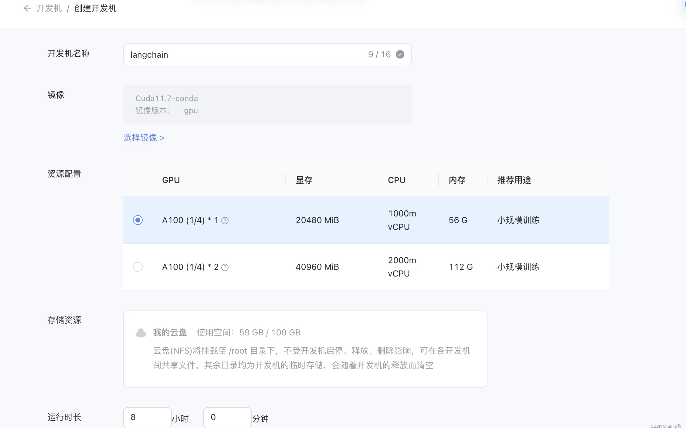

进入 conda 环境之后，使用以下命令从本地一个已有的 `pytorch 2.0.1` 的环境，激活环境，在环境中安装运行 demo 所需要的依赖。

```bash
conda activate InternLM

# 升级pip
python -m pip install --upgrade pip

pip install modelscope==1.9.5
pip install transformers==4.35.2
pip install streamlit==1.24.0
pip install sentencepiece==0.1.99
pip install accelerate==0.24.1
```


#### 1.2 模型下载
在本地的 `/root/share/temp/model_repos/internlm-chat-7b `目录下已存储有所需的模型文件参数，可以直接拷贝到个人目录的模型保存地址：
```bash
mkdir -p /root/data/model/Shanghai_AI_Laboratory
cp -r /root/share/temp/model_repos/internlm-chat-7b /root/data/model/Shanghai_AI_Laboratory/internlm-chat-7b
```
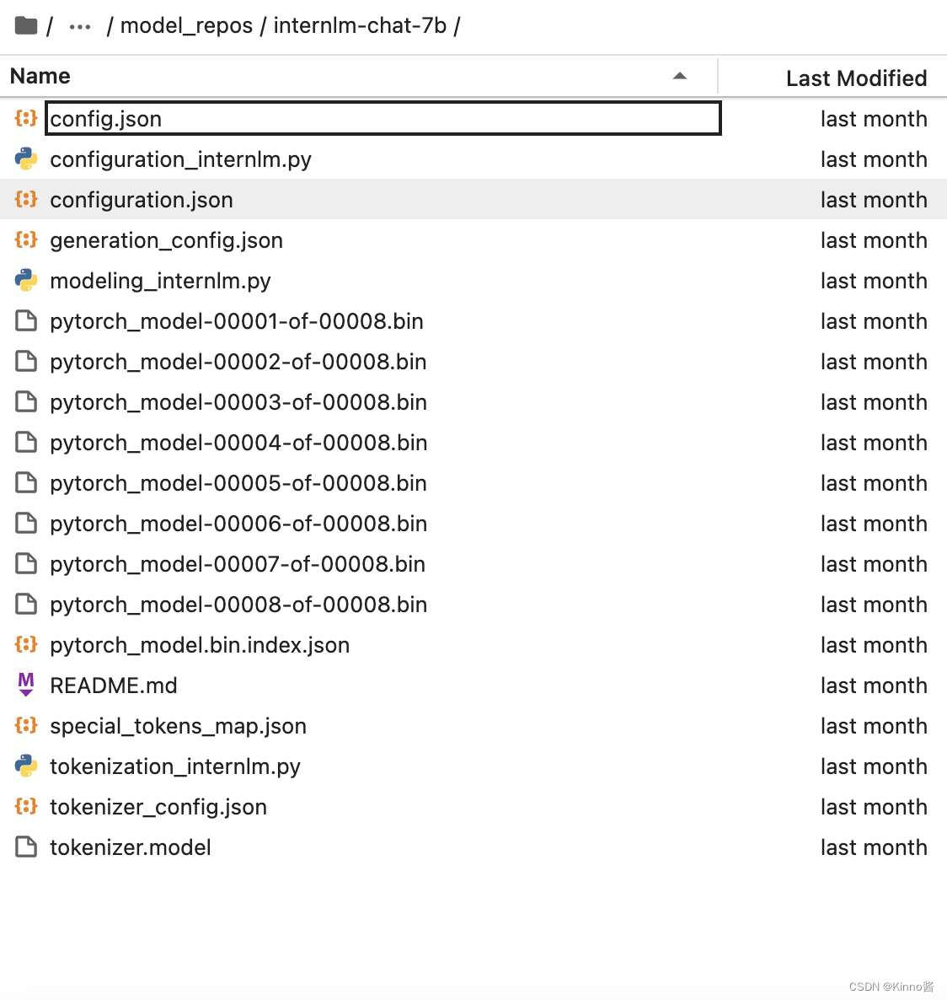


#### 1.3 LangChain 相关环境配置
在已完成 InternLM 的部署基础上，还需要安装以下依赖包：
```bash
pip install langchain==0.0.292
pip install gradio==4.4.0
pip install chromadb==0.4.15
pip install sentence-transformers==2.2.2
pip install unstructured==0.10.30
pip install markdown==3.3.7
```
下载并使用开源词向量模型 [Sentence Transformer](https://huggingface.co/sentence-transformers/paraphrase-multilingual-MiniLM-L12-v2)
```bash
pip install -U huggingface_hub
```
使用huggingface镜像下载
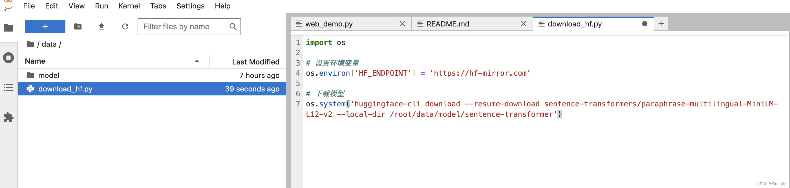
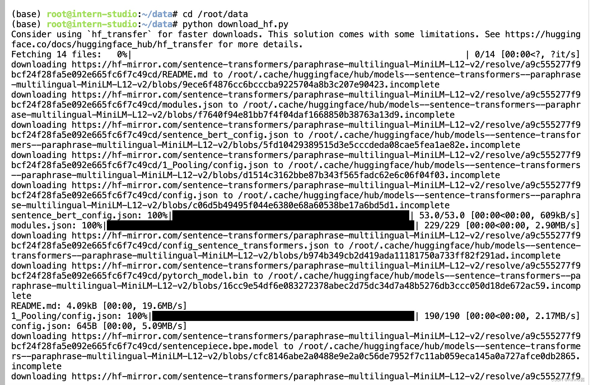
#### 1.4 下载 NLTK 相关资源
我们在使用开源词向量模型构建开源词向量的时候，需要用到第三方库 [`nltk`](https://www.nltk.org/) 的一些资源。正常情况下，其会自动从互联网上下载，但可能由于网络原因会导致下载中断，此处我们可以从国内仓库镜像地址下载相关资源，保存到服务器上。

我们用以下命令下载 nltk 资源并解压到服务器上：
```bash
cd /root
git clone https://gitee.com/yzy0612/nltk_data.git  --branch gh-page s
cd nltk_data
mv packages/*  ./
cd tokenizers
unzip punkt.zip
cd ../taggers
unzip averaged_perceptron_tagger.zip
```
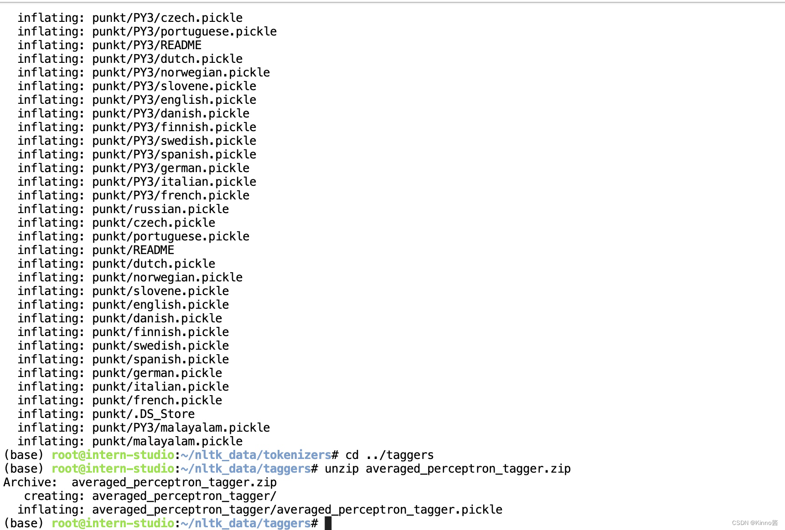
### 知识库搭建
2.1 数据收集
选择由上海人工智能实验室开源的一系列大模型工具开源仓库作为语料库来源，包括：

[OpenCompass](https://gitee.com/open-compass/opencompass#https://gitee.com/link?target=https%3A%2F%2Fopencompass.readthedocs.io%2Fzh_CN%2Flatest%2Fget_started%2Fquick_start.html)：面向大模型评测的一站式平台
IMDeploy：涵盖了 LLM 任务的全套轻量化、部署和服务解决方案的高效推理工具箱
XTuner：轻量级微调大语言模型的工具库
InternLM-XComposer：浦语·灵笔，基于书生·浦语大语言模型研发的视觉-语言大模型
Lagent：一个轻量级、开源的基于大语言模型的智能体（agent）框架
InternLM：一个开源的轻量级训练框架，旨在支持大模型训练而无需大量的依赖

首先我们需要将上述远程开源仓库 Clone 到本地，可以使用以下命令：
```bash
# 进入到数据库盘
cd /root/data
# clone 上述开源仓库
git clone https://gitee.com/open-compass/opencompass.git
git clone https://gitee.com/InternLM/lmdeploy.git
git clone https://gitee.com/InternLM/xtuner.git
git clone https://gitee.com/InternLM/InternLM-XComposer.git
git clone https://gitee.com/InternLM/lagent.git
git clone https://gitee.com/InternLM/InternLM.git
```
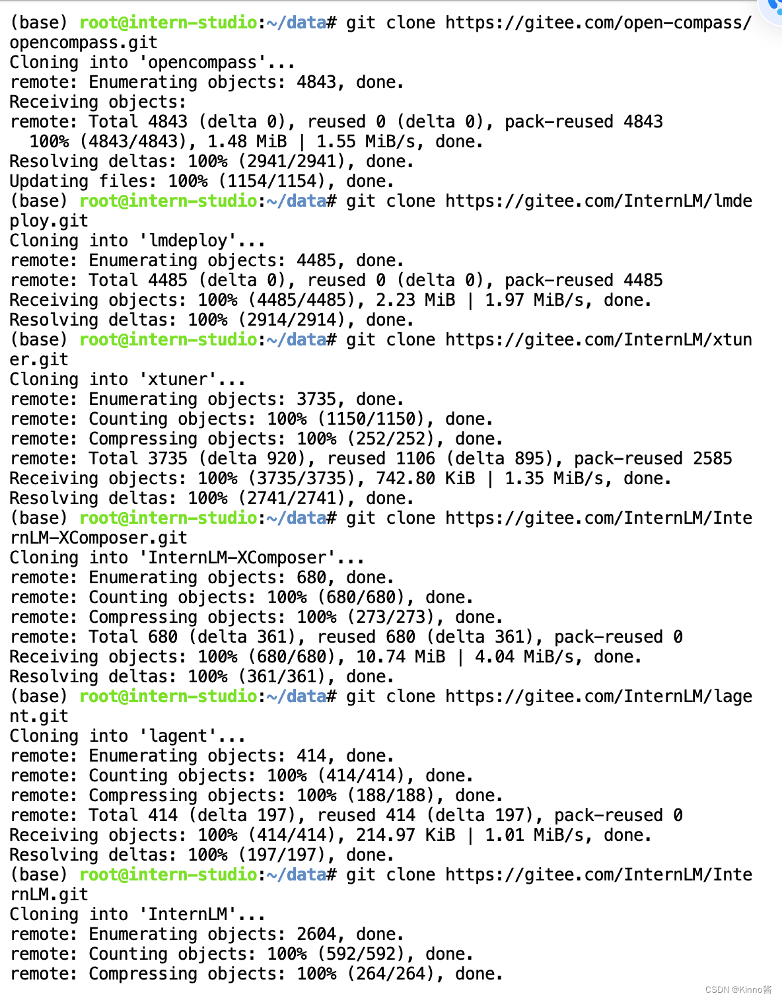


新建`/root/data/demo`用于存放构建个人向量数据库的代码
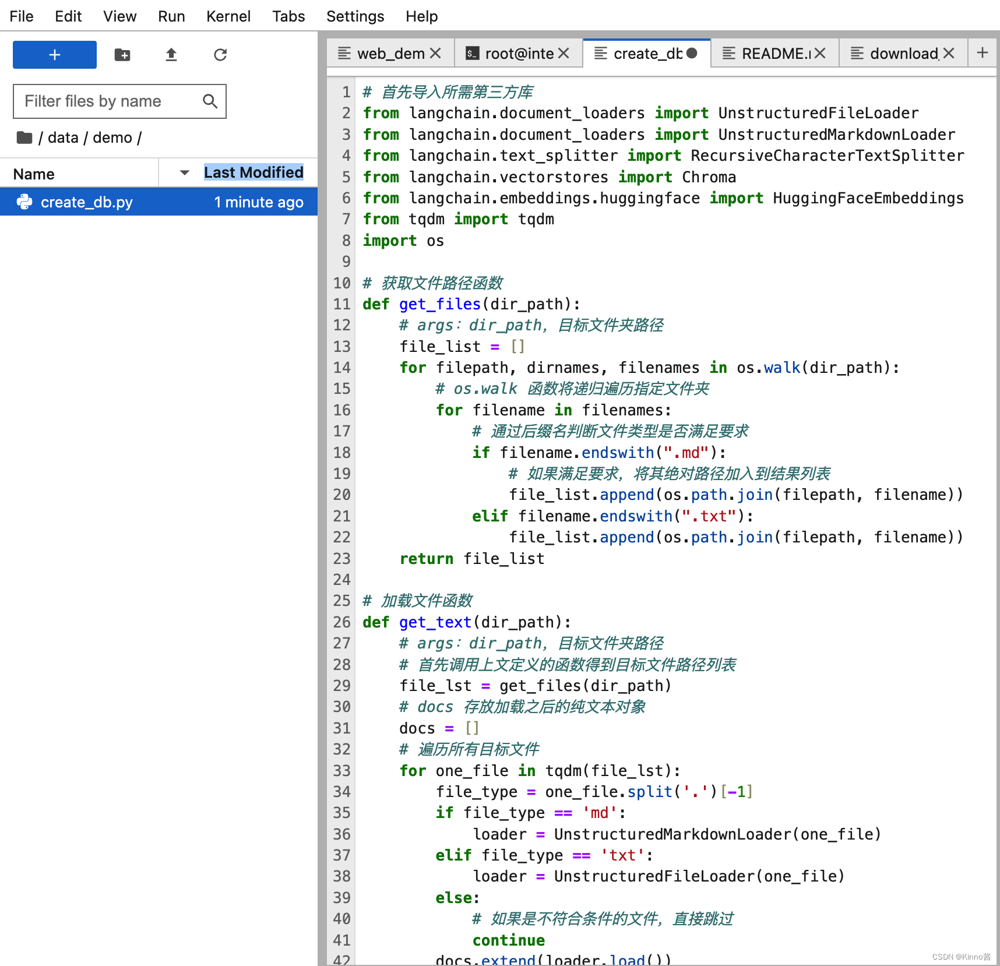
并运行该脚本
```bash
python create_db.py
```
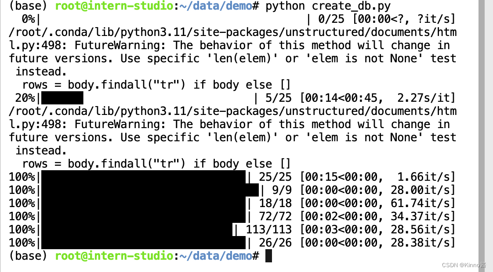
运行完后demo目录下出现了`data_base`目录，在这个文件夹中就存放了我们所需要的向量数据库的文件
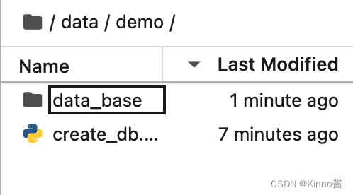
###  InternLM 接入 LangChain
`LLM.py`：
```python
from langchain.llms.base import LLM
from typing import Any, List, Optional
from langchain.callbacks.manager import CallbackManagerForLLMRun
from transformers import AutoTokenizer, AutoModelForCausalLM
import torch

class InternLM_LLM(LLM):
    # 基于本地 InternLM 自定义 LLM 类
    tokenizer : AutoTokenizer = None
    model: AutoModelForCausalLM = None

    def __init__(self, model_path :str):
        # model_path: InternLM 模型路径
        # 从本地初始化模型
        super().__init__()
        print("正在从本地加载模型...")
        self.tokenizer = AutoTokenizer.from_pretrained(model_path, trust_remote_code=True)
        self.model = AutoModelForCausalLM.from_pretrained(model_path, trust_remote_code=True).to(torch.bfloat16).cuda()
        self.model = self.model.eval()
        print("完成本地模型的加载")

    def _call(self, prompt : str, stop: Optional[List[str]] = None,
                run_manager: Optional[CallbackManagerForLLMRun] = None,
                **kwargs: Any):
        # 重写调用函数
        system_prompt = """You are an AI assistant whose name is InternLM (书生·浦语).
        - InternLM (书生·浦语) is a conversational language model that is developed by Shanghai AI Laboratory (上海人工智能实验室). It is designed to be helpful, honest, and harmless.
        - InternLM (书生·浦语) can understand and communicate fluently in the language chosen by the user such as English and 中文.
        """
        
        messages = [(system_prompt, '')]
        response, history = self.model.chat(self.tokenizer, prompt , history=messages)
        return response
        
    @property
    def _llm_type(self) -> str:
        return "InternLM"
```
`web_demo.py`:
```python
from langchain.vectorstores import Chroma
from langchain.embeddings.huggingface import HuggingFaceEmbeddings
import os
from LLM import InternLM_LLM
from langchain.prompts import PromptTemplate
from langchain.chains import RetrievalQA

import gradio as gr


def load_chain():
    # 加载问答链
    # 定义 Embeddings
    embeddings = HuggingFaceEmbeddings(model_name="/root/data/model/sentence-transformer")

    # 向量数据库持久化路径
    persist_directory = 'data_base/vector_db/chroma'

    # 加载数据库
    vectordb = Chroma(
        persist_directory=persist_directory,  # 允许我们将persist_directory目录保存到磁盘上
        embedding_function=embeddings
    )

    # 加载自定义 LLM
    llm = InternLM_LLM(model_path = "/root/data/model/Shanghai_AI_Laboratory/internlm-chat-7b")

    # 定义一个 Prompt Template
    template = """使用以下上下文来回答最后的问题。如果你不知道答案，就说你不知道，不要试图编造答
    案。尽量使答案简明扼要。总是在回答的最后说“谢谢你的提问！”。
    {context}
    问题: {question}
    有用的回答:"""

    QA_CHAIN_PROMPT = PromptTemplate(input_variables=["context","question"],template=template)

    # 运行 chain
    qa_chain = RetrievalQA.from_chain_type(llm,retriever=vectordb.as_retriever(),return_source_documents=True,chain_type_kwargs={"prompt":QA_CHAIN_PROMPT})
    
    return qa_chain

class Model_center():
    """
    存储检索问答链的对象 
    """
    def __init__(self):
        # 构造函数，加载检索问答链
        self.chain = load_chain()

    def qa_chain_self_answer(self, question: str, chat_history: list = []):
        """
        调用问答链进行回答
        """
        if question == None or len(question) < 1:
            return "", chat_history
        try:
            chat_history.append(
                (question, self.chain({"query": question})["result"]))
            # 将问答结果直接附加到问答历史中，Gradio 会将其展示出来
            return "", chat_history
        except Exception as e:
            return e, chat_history


# 实例化核心功能对象
model_center = Model_center()
# 创建一个 Web 界面
block = gr.Blocks()
with block as demo:
    with gr.Row(equal_height=True):   
        with gr.Column(scale=15):
            # 展示的页面标题
            gr.Markdown("""<h1><center>InternLM</center></h1>
                <center>书生浦语</center>
                """)

    with gr.Row():
        with gr.Column(scale=4):
            # 创建一个聊天机器人对象
            chatbot = gr.Chatbot(height=450, show_copy_button=True)
            # 创建一个文本框组件，用于输入 prompt。
            msg = gr.Textbox(label="Prompt/问题")

            with gr.Row():
                # 创建提交按钮。
                db_wo_his_btn = gr.Button("Chat")
            with gr.Row():
                # 创建一个清除按钮，用于清除聊天机器人组件的内容。
                clear = gr.ClearButton(
                    components=[chatbot], value="Clear console")
                
        # 设置按钮的点击事件。当点击时，调用上面定义的 qa_chain_self_answer 函数，并传入用户的消息和聊天历史记录，然后更新文本框和聊天机器人组件。
        db_wo_his_btn.click(model_center.qa_chain_self_answer, inputs=[
                            msg, chatbot], outputs=[msg, chatbot])

    gr.Markdown("""提醒：<br>
    1. 初始化数据库时间可能较长，请耐心等待。
    2. 使用中如果出现异常，将会在文本输入框进行展示，请不要惊慌。 <br>
    """)
gr.close_all()
# 直接启动
demo.launch()
```

```bash
python web_demo.py
```

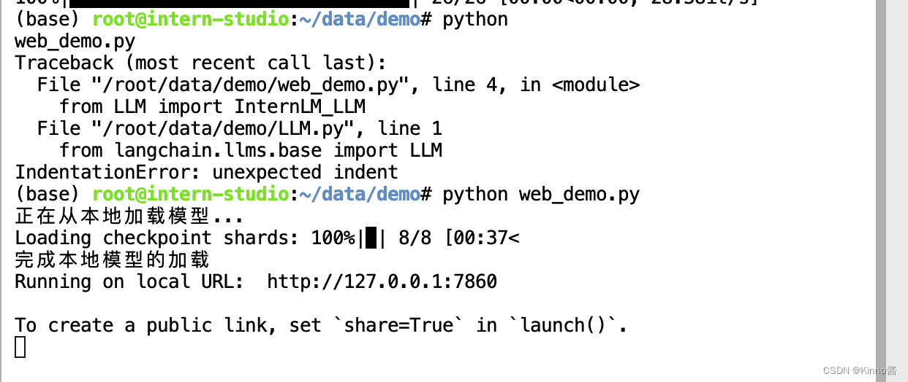

在你自己的本地机命令行输入：
```bash
ssh -CNg -L 7860:127.0.0.1:7860 root@ssh.intern-ai.org.cn -p [your server port]
```


**在本地浏览器输入`127.0.0.1:7860`，即可访问：**

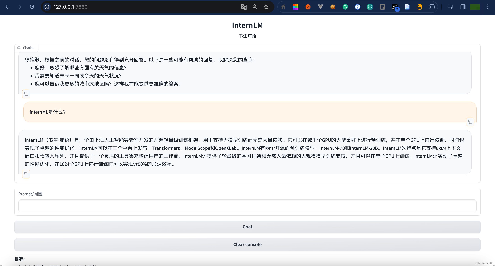


## 2. 进阶作业：

选择一个垂直领域，收集该领域的专业资料构建专业知识库，并搭建专业问答助手，并在 OpenXLab 上成功部署（截图，并提供应用地址）
### 2.1 本地试运行
自己的知识库数据集
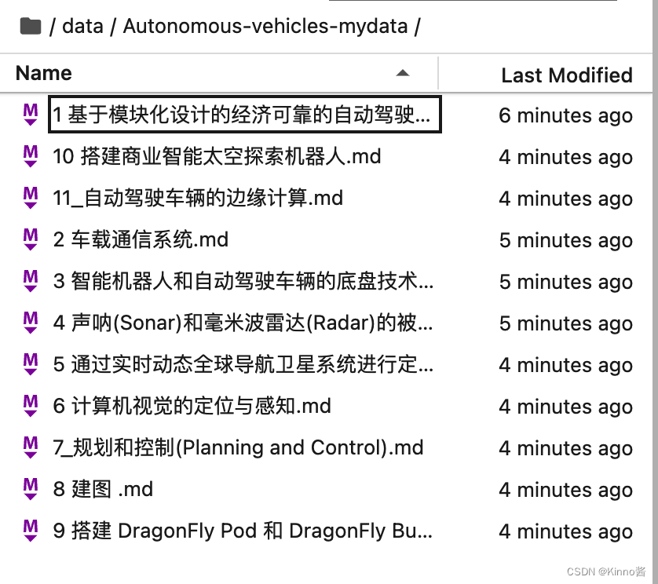
```python
# 目标文件夹
tar_dir = [
    "/root/data/Autonomous-vehicles-mydata
]
```
 requirements.txt
 ```
 pytorch==2.0.1
modelscope==1.9.5
transformers==4.35.2
streamlit==1.24.0
sentencepiece==0.1.99
accelerate==0.24.1
langchain==0.0.292
gradio==4.4.0
chromadb==0.4.15
sentence-transformers==2.2.2
unstructured==0.10.30
markdown==3.3.7
 ```
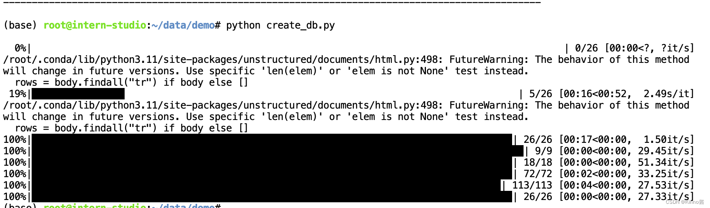

配置git环境：
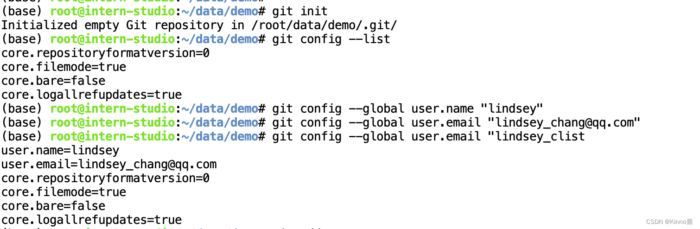
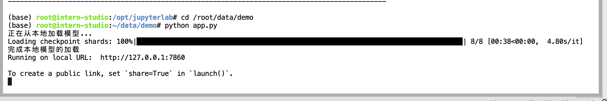
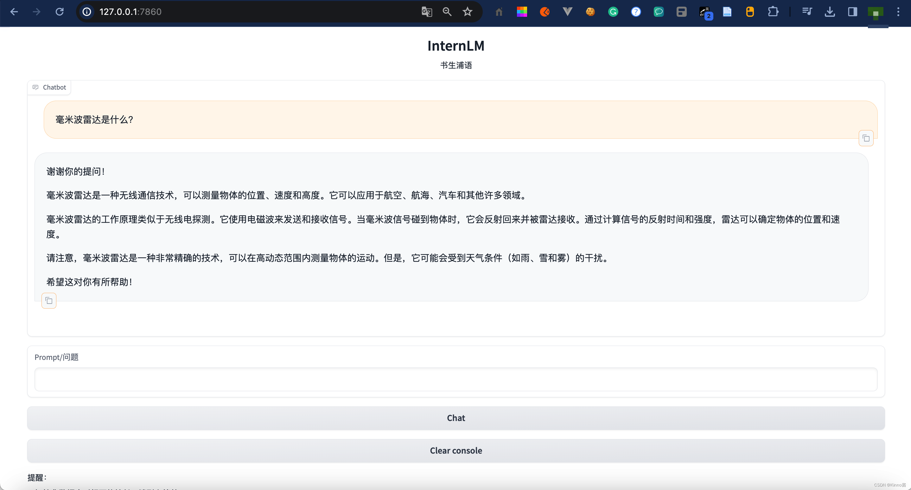
提交到本地仓库：
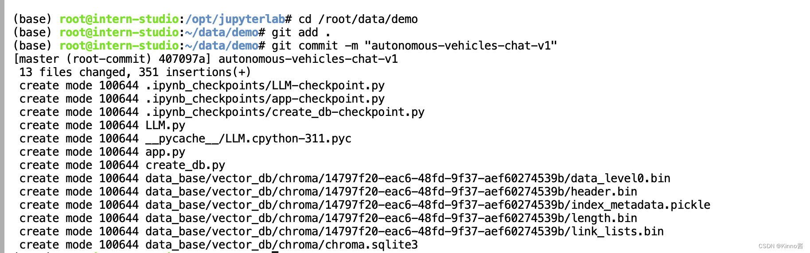
### 2.2 成果
[GitHub - autonomous-vehicles-chat](https://github.com/lindsey-chang/autonomous-vehicles-chat)

### 2.3 展示

 [https://openxlab.org.cn/apps/detail/Lindsey/autonomous-vehicles-chat-lindsey](https://openxlab.org.cn/apps/detail/Lindsey/autonomous-vehicles-chat-lindsey)

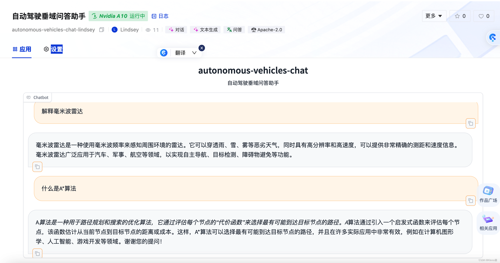

单纯只有RAG的话对于长回答的表现效果一般。会出错，比如以下图中询问自动驾驶等级就有一处重复。
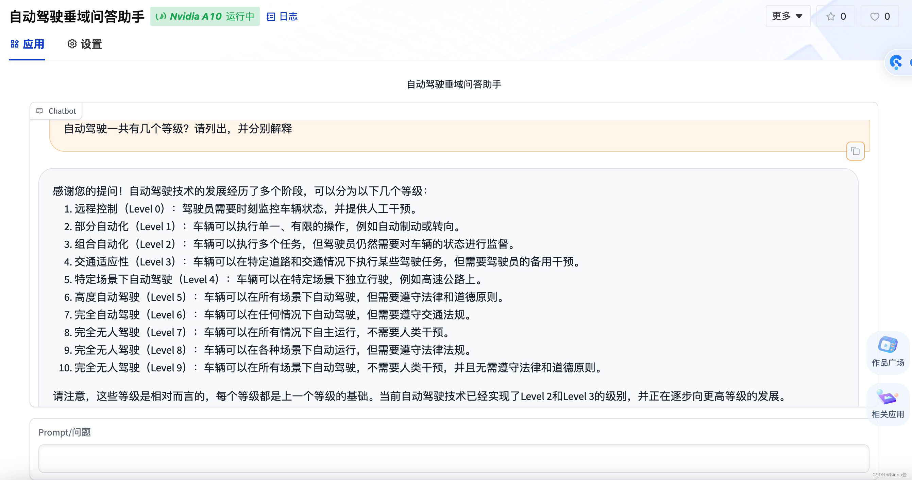
